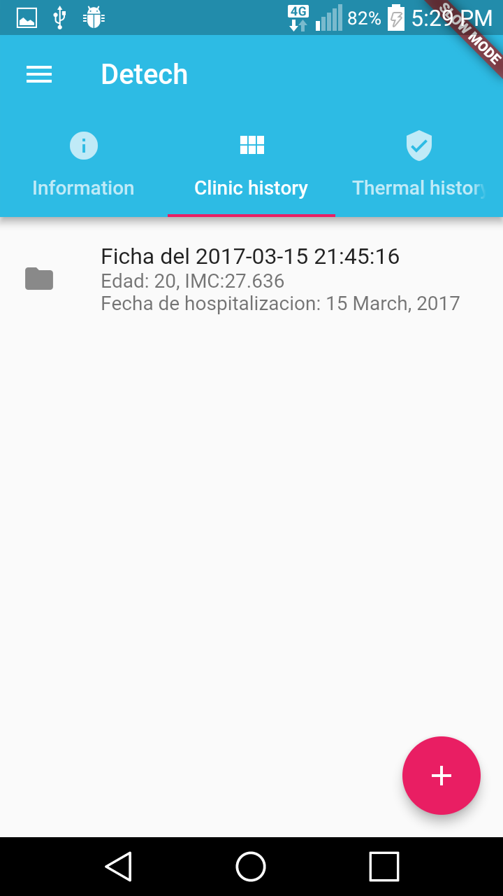

# Detech App

*Detech mobile app for visualizing patient information.*

The app has only visualization purposes. The creation and maintaining of patient info is supported in the [Detech web app](link to....).

The app has been written with [Flutter](https://flutter.io) using the [Dart](https://www.dartlang.org/) programming language. Flutter is a mobile app SDK that helps us to build modern mobile apps for iOS and Android.

We are using Firebase as our backend, from which we retrieve data of patients, doctors, and images.

**_Note:_** The photos taken by the [thermal camera](link to...) will appear in the 'thermal history' tab of whichever the patient we are currently seeing in the app. We assume that there is only one gun device and the photos are not associated with any particular patient yet. 

## Features

- **Login** ([main.dart](./lib/main.dart)) 
  You must provide a valid doctor username to enter the system. Password is not validated yet. All credentials are stored in Firebase.   
	

- **All patient list** ([dashboard.dart](./lib/dashboard.dart))
  The list of all registered patients.  
  
  
- **Single patient info** ([patientInfo.dart](./lib/patientInfo.dart))
  The detailed view of a single patient personal information.  
  
  
- **Single patient clinic history** ([patientCH.dart](./lib/patientCH.dart))
  The view of a single patient clinic history.  
  
  
- **Single patient clinic history detail** ([HistoryShow.dart](./lib/HistoryShow.dart))
  The detailed view of one clinic history of a single patient.  
  
  
- **Single patient thermal history** ([patientThermal.dart](./lib/patientThermal.dart))
  The detailed view of a single patient thermal history. The pictures taken by the gun-device are shown here in real time.  
  
  

## Dependencies

- Flutter: Please follow the [Flutter installation guide](https://flutter.io/setup/) for your particular OS.
- Android toolchain: For Android development it is necessary to install Android Studio and the Android SDK.
- iOS toolchain: For iOS development it is necessary a Mac with Xcode 7.2 or newer.

## Installation

Once you have cloned the Flutter git repository and added the `flutter` tool to your path, run command `flutter doctor` to see if any other dependency is necessary.  
You might need to install the Android Studio separately if it is not already installed.  

Please follow the [installation guide](https://flutter.io/setup/) carefully for running using Android or iOS platform.

## Notes

The login credentials for testing purposes are:  
username: `bregymr`  
password: (no password)

## License

## Authors
